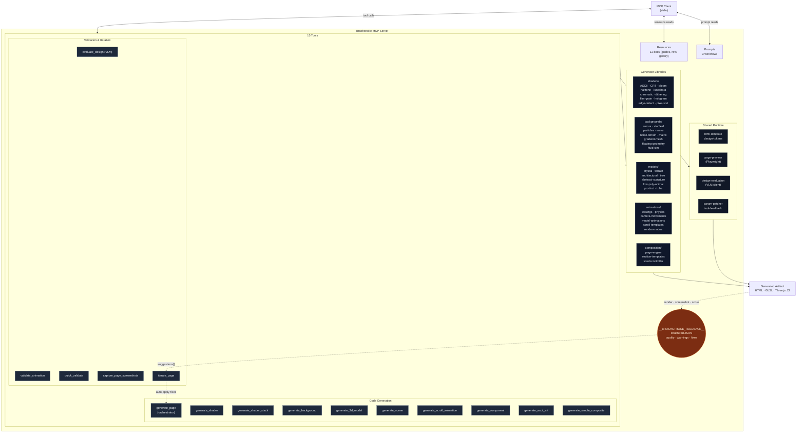

# Brushstroke

An **MCP server** for generating Three.js / WebGL landing pages, shaders, 3D scenes, scroll animations, and post-processing stacks — with built-in visual validation and an iteration loop.

Brushstroke exposes **15 tools**, **11 browsable resources**, and **3 workflow prompts** over stdio. Every tool returns structured JSON feedback (`__BRUSHSTROKE_FEEDBACK__`) with a 0–100 quality score, categorized warnings, and parameter-level fix suggestions — so an agent can evaluate its own output and iterate automatically.

---

## Architecture



### The generate → evaluate → fix loop

1. Client calls `generate_page` with `preview: true`
2. Server generates HTML, renders it in headless Chromium, captures screenshots
3. VLM (or heuristic fallback) scores the output across quality categories
4. Response includes both the HTML **and** a `__BRUSHSTROKE_FEEDBACK__` block with `suggestions[]` — each carrying a `paramPath`, a `suggestedValue`, reasoning, and expected impact
5. Client applies fixes via `iterate_page`, which patches parameters by dot-path and regenerates (up to 5 iterations, halts at score ≥ 85)

---

## Tool catalog

| Tool                         | Purpose                                                                |
| ---------------------------- | ---------------------------------------------------------------------- |
| `generate_page`              | Full landing page: backgrounds + models + sections + scroll animations |
| `generate_shader`            | Single GLSL effect (ASCII, CRT, bloom, halftone, hologram, …)          |
| `generate_shader_stack`      | Chained post-processing pipeline with blend modes                      |
| `generate_simple_composite`  | Low-ceremony shader composition for single effects                     |
| `generate_background`        | Animated background module (9 presets)                                 |
| `generate_3d_model`          | Procedural geometry (7 model families)                                 |
| `generate_scene`             | Custom Three.js scene module (without full page chrome)                |
| `generate_scroll_animation`  | Camera path + scroll-driven tweens                                     |
| `generate_component`         | Vanilla HTML/CSS/JS UI components                                      |
| `generate_ascii_art`         | Image/video → ASCII pipeline                                           |
| `evaluate_design`            | VLM-based visual quality scoring                                       |
| `validate_animation`         | Static analysis for animation code                                     |
| `quick_validate`             | Fast heuristic checks (no rendering)                                   |
| `capture_page_screenshots`   | Headless browser capture utility                                       |
| `iterate_page`               | Auto-apply feedback fixes and regenerate                               |

---

## Theme presets

| Preset         | Heading Font             | Feel                 |
| -------------- | ------------------------ | -------------------- |
| `dark_premium` | Inter 700                | Luxury, cyan accent  |
| `light_clean`  | Inter 700                | Professional, teal   |
| `minimal`      | Inter 600                | Restrained, gray     |
| `startup_bold` | Space Grotesk 700        | Bold SaaS, orange    |
| `editorial`    | Playfair Display 700     | Magazine, red        |

---

## Install & run

```bash
npm install
npm run build
node dist/index.js    # stdio MCP server
```

Wire into an MCP client by pointing at the built entry:

```json
{
  "mcpServers": {
    "brushstroke": {
      "command": "node",
      "args": ["/absolute/path/to/brushstroke/dist/index.js"]
    }
  }
}
```

Optional: install Playwright browsers for visual preview / screenshot capture:

```bash
npx playwright install chromium
```

---

## Project layout

```
src/
├── server.ts              MCP server registration (tools + resources + prompts)
├── tools/                 15 tool handlers — thin glue over generator libs
├── shaders/               GLSL effect library (12+ families) + compositor
├── backgrounds/           9 animated background modules
├── models/                7 procedural 3D model families
├── animations/            Easings, physics, camera paths, scroll templates
├── composition/           Page engine, section templates, scroll controller
├── components/vanilla/    HTML/CSS/JS components
├── validation/vlm/        VLM client + design prompts
├── resources/             11 MCP resources (guides, refs, gallery)
├── prompts/               3 workflow prompts
├── types/                 Shared type definitions (StructuredFeedback, etc.)
└── utils/                 html-template, page-preview, param-patcher, color-utils
```

---

## Feedback format

Every tool response ends with a `__BRUSHSTROKE_FEEDBACK__` content block:

```json
{
  "quality": {
    "overall": 82,
    "pass": true,
    "breakdown": { "composition": 85, "motion": 78, "color": 90 }
  },
  "warnings": [
    { "code": "LOW_CONTRAST", "severity": "medium", "category": "color" }
  ],
  "suggestions": [
    {
      "paramPath": "background.particles.count",
      "suggestedValue": 1200,
      "reasoning": "Current density feels sparse at target resolution.",
      "impact": "Increases visual richness without meaningful FPS cost."
    }
  ],
  "metadata": { "tool": "generate_page" }
}
```

This machine-readable shape is what makes the iteration loop possible: a client doesn't need to interpret prose — it applies `suggestions[].paramPath` → `suggestedValue` and calls the tool again.

---

## Tech

- TypeScript · `@modelcontextprotocol/sdk` over stdio
- Three.js (emitted in generated output)
- Playwright (headless Chromium for preview)
- Zod (tool input schemas)
- Vitest (test runner — suite TBD)
